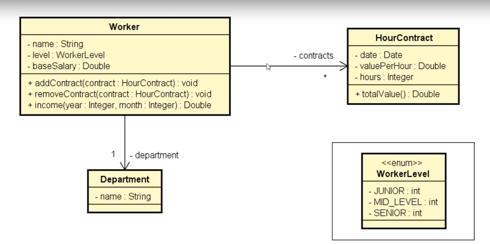

# Composition Worker

Projeto teste para exercitar relacionamento entre tabelas, enums e datas. Neste projeto criamos um pequeno sistema que recebe as informações de um trabalhador, salário base, quantidade de contratos e data do contrato, valor recebido por hora e duração do contrato, em horas. No final o programa deve mostrar o nome do trabalhador, departamento e o valor do salário no mês buscado (salário base + valor recebido por contratos naquele mês).

## Screenshots

## Stack utilizada

**Back-end:** Java

